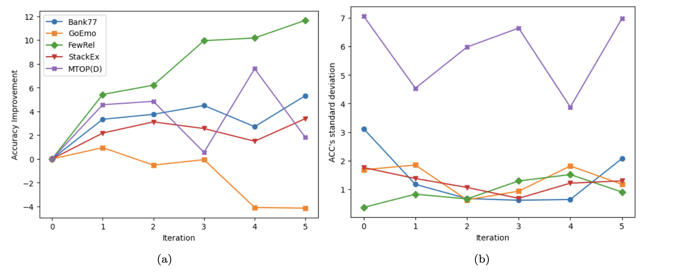
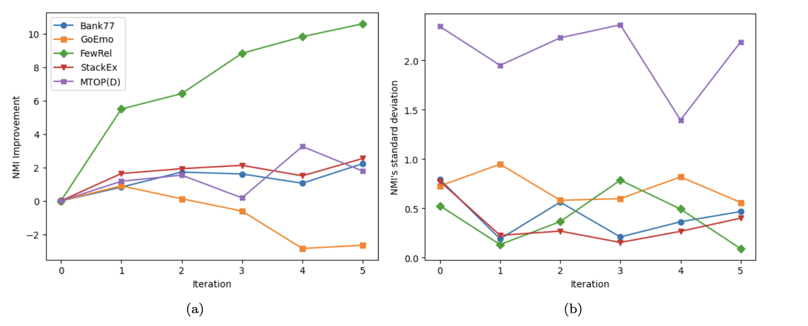

# CLUSTERLLM: Large Language Models as a Guide for Text Clustering


This is the official PyTorch implementation of paper [CLUSTERLLM: Large Language Models as a Guide for Text Clustering (EMNLP2023)](https://arxiv.org/abs/2305.14871).

## My works on this article

Due to limited resources for accessing the OpenAI API, reproducing the results of the article was not feasible. Instead, the research was adapted to fit the available capabilities. The work was conducted on a server at Paris Cité University, equipped with a 32GB GPU.

Given these technical constraints, the experiments focused on smaller open-source LLMs. I chose the Mistral-7B-v0.1 model, a pre-trained base model released in September 2023, which was competitive in performance, matching or surpassing larger models like Llama 2 13B. While Mistral-7B-v0.1 is not listed on the Massive Text Embedding Benchmark (MTEB) Leaderboard, which ranks models on various clustering tasks, it allowed us to conduct a preliminary evaluation of its clustering capabilities.

I focused on specific datasets for different clustering domains:

- Bank77 for intent discovery
- GoEmo for emotion classification
- FewRel for type discovery
- StackEx for subject extraction
- MTOP(D) for domain discovery

It is important to note that open-source model representations are readily accessible, and therefore, the strategy used in ClusterLLM is not necessarily the most effective for exploiting them fully.

### Finding optimal number of pipeline stacking

In the article, the authors used a technique of stacking the initial step four times to adjust the encoder, without providing any justification for the choice of the number four. This lack of clarification raises questions about the efficiency and optimization of this approach, especially after each iteration.

I decided to analyze the performance of ClusterLLM after each iteration of stacking. This study allowed us to determine the optimal number of stackings, balancing efficiency and cost. This is particularly relevant when using models based on APIs, such as ChatGPT, which incur costs with each use. Understanding these dynamics helps make informed decisions about resource allocation and fine-tuning the model to maximize performance while minimizing costs. This analysis not only evaluates the cost-effectiveness of the stacking strategy but also helps identify a potentially decreasing return on investment, guiding deployment strategies for real-world applications.





The analysis of the results confirms improvements in terms of accuracy and Normalized Mutual Information (NMI) after the first iteration. However, applying multiple stackings revealed performance declines. Indeed, an analysis of the accuracy graphs after each iteration shows that the performance does not consistently improve across all datasets. According to two figures, I observed that the trend is not always upward. There are iterations where performance decreases. This can be explained by the standard deviation and the random nature of choosing initial values for clustering.

When observing the results on the MTOP(D) dataset, I noticed a very high variance from the start, indicating that performance depends heavily on the choice of initial centroid values. On the other hand, a consistent improvement is observed on the FewRel dataset, with low standard deviation values over the iterations. Although this behavior requires further experiments and testing to be proven, it is an observation worth noting.

Thus, the ClusterLLM approach raises an important question about the optimal number of iterations. The fact that results vary greatly indicates that this parameter plays a crucial role. The inconsistencies observed in performance improvement highlight the need for a strategic approach to determine the number of iterations in order to effectively optimize results.

### Adjusting the Encoder Using the Second Step

In the ClusterLLM article, the second step is primarily described as a way to evaluate the granularity of clustering. However, as I saw, there is potential to use this step as a mechanism for improving the overall performance of the model. Building on this perspective, I used the original sampling method employed during the second step while introducing a modification to the loss function to better address our specific challenges:

$$
      l_j = \frac{\sum w_j^* s(x_j,y_j)^2}{\sum (1 - w_j^*)s(x_j,y_j)^2}
$$

Here, \(x\) and \(y\) represent two points sampled from the data, and \(w^_\) denotes the binary transformation \(w_j^_ = \{1,0\}\) derived from the original decision variable \(w_j = \{same, different\}\). With this formulation, I aims to minimize the loss such that points labeled as _different_ are distanced from each other, while those labeled as _same_ are brought closer, echoing the underlying principle of the original loss function. By adjusting this aspect of the model, I anticipate better differentiation and grouping of points, thereby improving the model's efficiency and accuracy.

This modification of the loss function aims to demonstrate the flexibility of the ClusterLLM approach, assessing its ability to accommodate adjustments in response to new requirements.

### Using centroids to improve the cluster's representation

In the field of unsupervised learning, the centroids of a group are often considered faithful representatives of that group. Theoretically, the main characteristics of the grouped elements are found in the centroids. However, the approach described in the first step of the article involves randomly selecting two instances from the closest clusters for triplet sampling. This raises the question: why not use the centroids as representative points instead?

Using the centroids provides a more stable and representative reference for comparisons, unlike randomly selected points, which can vary significantly and may not truly reflect the main characteristics of their clusters. The use of centroids aims to adjust the representativeness of the samples used in the encoder, potentially leading to the creation of more accurate and robust representation vectors.

In this experiment, I did not observe any significant difference. Analyzing the results, I found that the outcomes were similar to those obtained with the original approach.


## Install

```bash
pip install -r requirements.txt
```

## Datasets

Download zip file [here](https://drive.google.com/file/d/1TBq3vkfm3OZLi90GVH-PVNKi3fk1Vba7/view?usp=sharing) and unzip.

## Steps to run perspective experiments

### 1. Original embeddings

```bash
cd perspective/2_finetune
bash scripts/get_embedding.sh
```

The embeddings are produced in each folder of `datasets`. It will also save the clustering measures. Details instructions see bash script. E5 embeddings are produced with `scripts/get_embedding_e5.sh`.

### 2. Sample triplets

```bash
cd perspective/1_predict_triplet
bash scripts/triplet_sampling.sh
```

Sampled triplets will be produced in `perspective/1_predict_triplet/sampled_triplet_results`. Details instructions see bash script.

### 3. Predict triplets

First replace the openai keys in `perspective/1_predict_triplet/scripts/predict_triplet.sh`.

```bash
cd perspective/1_predict_triplet
bash scripts/predict_triplet.sh
```

Predicted triplets will be in `perspective/1_predict_triplet/predicted_triplet_results`. Details instructions see bash script.

### 4. Convert triplets

This step only converts the format.

```bash
cd perspective/2_finetune
bash scripts/convert_triplet.sh
bash scripts/convert_triplet_self.sh
```

Converted triplets will be in `perspective/2_finetune/converted_triplet_results`. Details instructions see bash script.

### 5. Finetune

```bash
cd perspective/2_finetune
bash scripts/finetune.sh
```

Finetuned model will be in `perspective/2_finetune/checkpoints`. Details instructions see bash script.

### 6. Finetune

```bash
cd perspective/2_finetune
bash scripts/get_embedding.sh
```

This time, switch to checkpoints. Clustering measures will be saved into checkpoint folder.

## Steps to run granularity experiments

### 1. Sample pairs

```bash
cd granularity
bash scripts/sample_pairs.sh
```

Sampled pairs will be saved in `sampled_pair_results`.

### [optional] Sample pairs for prompt

4 pairs will be sampled as in-context examples.

```bash
cd granularity
bash scripts/sample_pairs_for_prompt.sh
```

### 2. Predict pairs

First replace the openai keys in `granularity/scripts/predict_pairs.sh`.

```bash
cd granularity
bash scripts/predict_pairs.sh
```

Predicted pairs will be in `granularity/predicted_pair_results`. Also specify `prompt_file` to sampled the prompt.

### 3. Predict cluster num

```bash
cd granularity
bash scripts/predict_num_clusters.sh
```

Details instructions see bash script.

## OUR MODIFICATION

I have reduced the run for the whole pipeline into 2 bash scrips.

First, run `create_output_folders.sh` once to create a list of emptied folder to store ouput of each step in the pipeline:

```bash
bash create_output_folders.sh
```

Then run the pipeline,

```bash
bash run_file.sh -i 3 -e 4
```

For the first run, please run the pipeline with a small number of epoch and iteration to test the pipline.
The default iteration (-i) is 6 and epoch (-e) is 30.

**IMPORTANT**

Please run these 2 files in ClusterLLM or else the path's references in the bash files gonna be incorrect.
For example:

```bash
cd ClusterLLM
bash run_file.sh
```

## Citation

```
@misc{zhang2023clusterllm,
      title={ClusterLLM: Large Language Models as a Guide for Text Clustering},
      author={Yuwei Zhang and Zihan Wang and Jingbo Shang},
      year={2023},
      eprint={2305.14871},
      archivePrefix={arXiv},
      primaryClass={cs.CL}
}
```

## Thanks

Some of the code was adapted from:

- https://github.com/xlang-ai/instructor-embedding

## Contact

Yuwei Zhang yuz163@ucsd.edu
